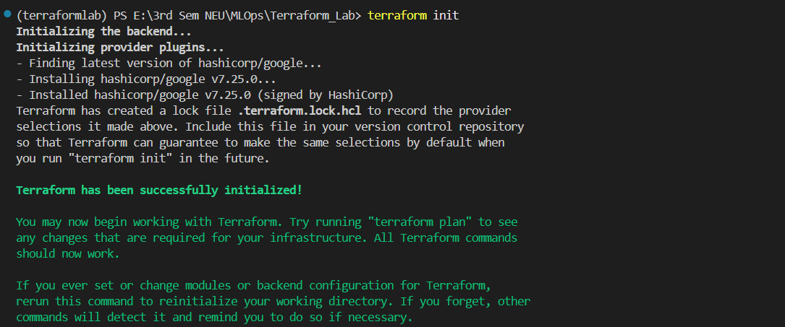
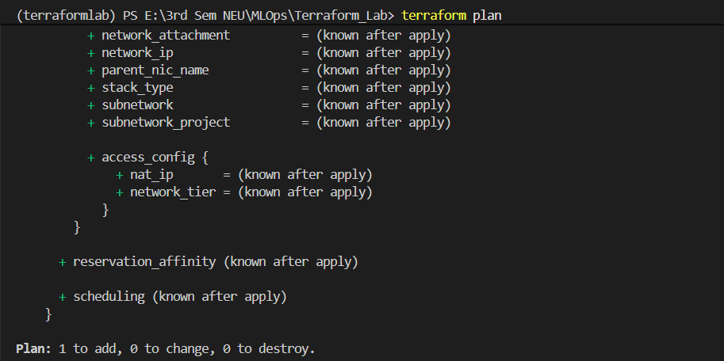
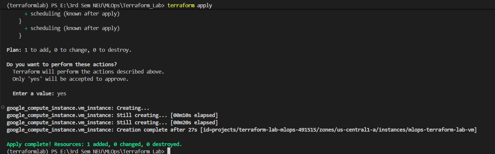
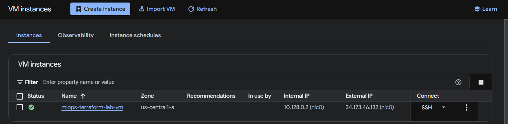

# Terraform Lab with GCP Infrastructure

This lab uses Terraform to provision a **Google Compute Engine (VM)** instance on **Google Cloud Platform (GCP)**. It follows MLOps best practices by separating configuration (variables) from infrastructure logic.

---

## Prerequisites

Before you begin, ensure you have the following installed and configured:

- **Google Cloud Account:** A project with billing enabled (or Free Trial credits).
- **Terraform:** [Install Terraform](https://developer.hashicorp.com/terraform/downloads).
- **Google Cloud SDK:** [Install gcloud CLI](https://cloud.google.com/sdk/docs/install).
- **VS Code:** (Recommended) with the [HashiCorp Terraform](https://marketplace.visualstudio.com/items?itemName=HashiCorp.terraform) extension.

---

## Step-by-Step Setup to run this lab

### 1. Clone the repository
```bash
git clone <REPOSITORY-LINK>
```

### 2. Authenticate with Google Cloud

Open your terminal and run the following command to allow Terraform to access your GCP account:

```bash
gcloud auth application-default login
```

> A browser window will open; log in with your Gmail account and click **"Allow."**

---

### 3. Project Configuration

1. Open `variables.tf`
2. Change the `default` value of `project_id` to your actual GCP Project ID:

```hcl
variable "project_id" {
  default = "your-actual-project-id"
}
```

---

### 4. Initialize the Workspace

Run this command to download the necessary Google Cloud providers:

```bash
terraform init
```

You can see the output as shown in below image:

---

### 5. Preview the Infrastructure

Generate an execution plan to see exactly what Terraform will create:

```bash
terraform plan
```

You can see the output as shown in below image:

---

### 6. Deploy to GCP

Apply the configuration to create your VM:

```bash
terraform apply
```

> Type `yes` when prompted to confirm.

You can see the output as shown in below image:


You will see the created VM instance in GCP console as shown in below image:

---
## Useful Commands Reference

| Command | Description |
|---|---|
| `terraform init` | Initializes the directory and downloads providers. |
| `terraform plan` | Shows what changes will happen without applying them. |
| `terraform apply` | Executes the plan to build infrastructure. |
| `terraform destroy` | **IMPORTANT:** Deletes everything to avoid charges. |

---

## File Structure

- **`main.tf`** — Contains the provider configuration and the `google_compute_instance` resource definition.
- **`variables.tf`** — Contains all input variables to make the code reusable and modular.